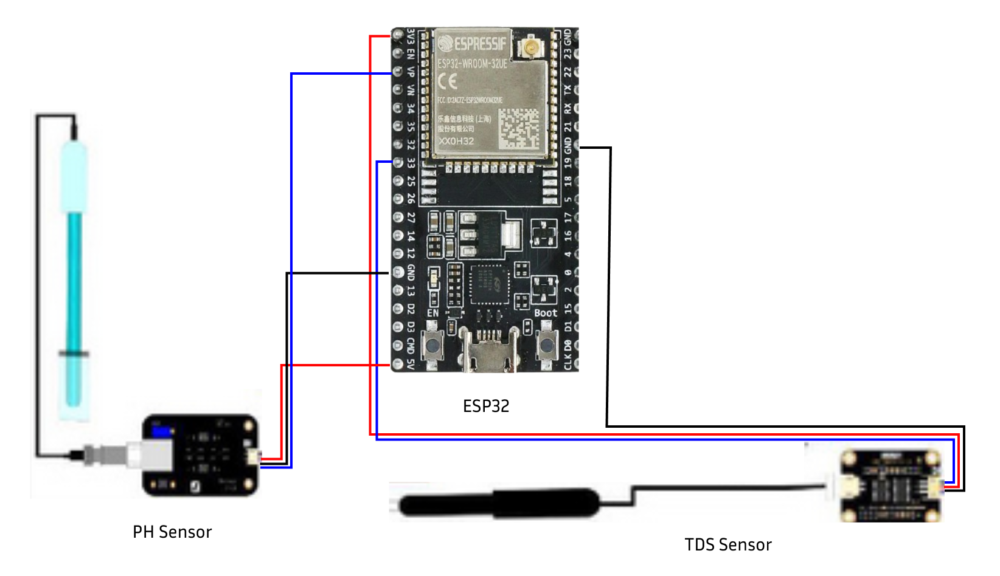

# bluesense-iot

## Overview

This repository contains the source code for the BlueSense IoT device. The device is designed for water quality monitoring and utilizes ESP32, pH sensor, and TDS sensor. The device follows two main data flow processes for monitoring and logging water quality:

1. **Periodic Data Logging:**
   - Every 10 minutes, the device sends data to a REST server for logging and history purposes.
2. **Real-Time Monitoring:**
   - The device sends data to an MQTT broker whenever there is a change in the monitored parameters for real-time monitoring.

## Hardware Components

- ESP32 microcontroller
- pH sensor
- TDS (Total Dissolved Solids) sensor

## Wiring Diagram



1. To run this project first create Credentials.h file
2. Filled the file with these data

```c
const char *ssid = <YOUR WIFI SSID>;
const char *password = <YOUR WIFI PASSWORD>;
const char *mqtt_server = <YOUR MQTT BROKER URL>;
const char *mqtt_username = <YOUR MQTT CLIENT USERNAME>;
const char *mqtt_password = <YOUR MQTT CLIENT PASSWORD>;
const int mqtt_port = <YOUR MQTT PORT>;
const String serverName = "https://bluesense.tech/";

```
